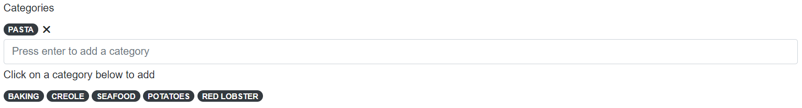
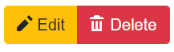

# Recipe Binder

Recipe Binder is a web app developed using Blazor Server (.NET Core 3.1). The app is hosted using Azure App Service and consists of connections to Azure SQL server, Azure SignalR, and Azure Key Vault. CI/CD is done using Azure DevOps.
Recipe Binder is a database app for recipes. Users can perform CRUD operations on recipes and search, filter, and sort recipes.
Try out Recipe Binder here: https://recipebinder.azurewebsites.net/

## Search, Filter and Sort Recipes

Upon visiting the website, you'll first be brought to the home page which will look something like this:

The home page lists all the public recipes added to the database by users. The first column of the table is the recipe name. Click on it to view the recipe. The next column is for category tags added to that recipe and the last column denotes how many users liked that recipe. You can filter recipes by entering a search query in the search bar and click on a radio button to sort the results by popularity or newest. Additonally, you can click on a recipe tag (or multiple recipe tags) to filter recipes which contain any of the selected tags:

Click on the X next to a category tag to remove the filter.

## Register

Many more features will be enabled once you register. Notice the Register and Log in links at the top:

If you haven't yet registered, click on Register. You'll then be taken to this page:

Here, you can create a new account using an email and password which you'll use to log in every time, or you can register using Google, Facebook, or Twitter. If you click on the button for one of the services, you'll either be authenticated immediately if you're already logged into that account on the browser you're using, or you'll be taken to the appropriate page where you can sign into your account of that service. Once you're successfully authenticated using one of the services, you'll be taken to one of these pages:

If there's an email associated with your account, the email input field will be populated with that email. If it's not, or you'd like to use a different email, enter that email into the inout field.

After clicking on the Regsiter button, whether you registered using an email and password or another service, if the registration was successful, you'll be taken to a mostly empty page with the following text:

Now, check your email. You should receive an email from recipebinder.noreply@gmail.com which looks like this:

Depending on where you're checking your email, Gmail desktop, for example, may show an empty email body with just 3 ellipses. Click on that to reveal the email body. If you don't see the email in your inbox, check your spam and/or junk folders. The email instruction is straightforward - just click on the link and once you do, you'll be taken to a mostly empty page with the following text:

You've sucessfully confirmed your email! Now you're ready to log in.

## Log in

If you already registered, click on the Log in link at the top. You'll be taken to this page:

If you created an account, login with the same credentials you used to register. If you registered using another service, click on that service button to authenticate.

## After Logging in

You'll notice the Register and Log in links at the top are replaced by Hello, <your-email-address> and Log out links:
  

Click on the Hello, <your-email-address> link to manage your account.
  
You'll also notice more items in the nav menu:

Before logging in, only the Home, View Code, and Report a Bug items were listed. Now you have access to My Recipes and New Recipe.
  

## My Recipes

Click on My Recipes from the nav menu. You'll be taken to a page which looks something like this:

This page works like the home page. The only difference is an additional filter. Click on a radio button to filter recipes that were created by you, shared with you, or liked by you.

## Create a New Recipe

Click on New Recipe from the nav menu. Beneath the page header is the Save button. Below that are several inputs split into 4 tabs.
The general tab is where you can enter the name of the recipe, the prep time, the cook time, the number of servings, and a link to a YouTube video for a tutorial on this recipe.

You can also click on the Upload Images button to upload images of this food.

Additionally, you can add categories to this recipe to help users come across your recipe more easily. Some existing category tags will already be displayed as recommendations. Click on any of those tags to add. As you type in the search input, the recommendations will be filtered. Once you hit the Enter key in the search input, the value that you typed will be added as a category. Click on the X next to a category tag to remove.

The Ingredients tab is where you can enter the name and quantity of each ingredient. Click on the New Ingredient button to add one or a button with the trash can to delete the ingredient on that row.

The Directions tab is where you can enter the description and assign a step number for each direction. Click on the New Direction button to add one or a button with the trash can to delete the direction on that row.

By default, all recipes are made public and can be found on the home page. If you'd like to make a recipe private, turn on the switch in the Permissions tab.

A private recipe can only be viewed and edited by you unless you grant access to a friend. Enter the email address of a friend to grant view access and check the checkbox to grant edit access. Click on the Grant access to a friend button to add another friend or a button with the trash can to delete access for the friend on that row. Friends will find this recipe on their My Recipes page using the Shared with Me filter.

Once you're done, click on the Save button to add the recipe to the database.

## Edit and Delete Recipes

When you're on the page to read a recipe and you have edit access for that recipe, you'll notice an Edit button and a Delete button beneath the page header:

The Edit button will take you to a page that works like the New Recipe page, except all the inputs will be populated with their existing values. Click on the save button to update the recipe with your modifications. The Delete button will take you to a page that will confirm whether you surely want to delete the recipe. Once you've carefully reviewed the recipe, click on the Delete button to delete the recipe from the database.

## Like Recipes

When you're on the page to read a recipe and you don't have edit access for that recipe, you'll notice a Like button beneath the page header. Click on it to give the recipe a like.

After liking a recipe, the Like button will turn into an Unlike button. Click on it to remove your like.

## View Code

Click on View Code from the nav menu to go the GitHub page for this repo.

## Report a Bug

Click on Report a Bug from the nav menu to open this modal:

If you find any bugs in this app, please report it using this feature. Enter a title, a description, any screenshots, and then submit.

## The End

Feel free to use this app for its intended purpose. If you like this app, make sure to give it a star!
